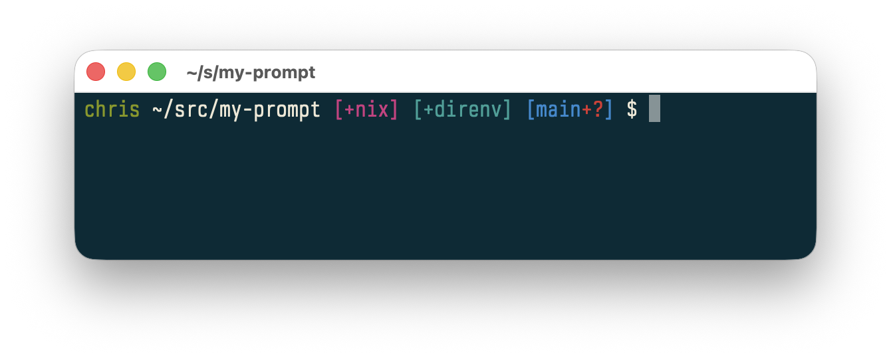

# my-prompt

`my-prompt` is my personal shell prompt I use every day. It is a small
Rust CLI inspired by [prmt](https://github.com/3axap4eHko/prmt), with Fish
integration, Git and direnv awareness, a transient prompt, and a Claude Code
status line.

The config is intentionally opinionated, while the implementation, tests,
packaging, and release process help me learn more about Rust and its ecosystem.
Fork it if your preferred prompt differs from mine!



Prompt rendering is best-effort. If a module cannot obtain trustworthy data that
segment is omitted silently. 

The project is pre-1.0 so breaking changes are almost guaranteed :sweat_smile:

## Installation

See [releases](https://github.com/Cbeck527/my-prompt/releases/latest) to grab the binary.

### Nix

```nix
# in your root flake
nixConfig = {
  extra-substituters = [ "https://my-prompt.cachix.org" ];
  extra-trusted-public-keys = [
    "my-prompt.cachix.org-1:aIzUDavhE5lzcsn6awg73yVAUnjMrAeqPATi3XrIZ0Q="
  ];
};

inputs.my-prompt.url = "github:cbeck527/my-prompt";

# then set it up with home-manager
{
  imports = [ inputs.my-prompt.homeModules.default ];

  programs.my-prompt = {
    enable = true;
    enableFishIntegration = true;
  };
}

# or just install the package
home.packages = [
  inputs.my-prompt.packages.${pkgs.stdenv.hostPlatform.system}.my-prompt
];
```

The cache settings must be on your root flake because an input's `nixConfig`
does not configure its consumer. Let `my-prompt` use its own locked `nixpkgs`
revision so the package store path matches the path built by this project's CI.
You can deliberately make `my-prompt.inputs.nixpkgs` follow your root `nixpkgs`,
but doing so will usually miss the project-built package cache.

Test it before installing:

```bash
nix run github:cbeck527/my-prompt
```

### Cargo

Install a tagged source revision directly from GitHub:

```bash
cargo install --git https://github.com/cbeck527/my-prompt \
  --tag v0.3.0 --locked
```
